"# node-http-serverless-soon" 

# A. Introduction

There are many different Serverless Framework available that we can use to implement a Serverless Application (https://geekflare.com/serverless-apps-frameworks/).

Basically these frameworks provide the step-by-step instructions to guide us through the procedure to follow that build the serverless application.

In this repository, we will use the Serverless Framework available at https://www.serverless.com/framework to build our serverless application.

Serverless Framework is a vendor-agnostic framework which supports serveless application development and deployment in a lot of cloud providers such as AWS, Microsoft Azure, Google Cloud, Apache OpenWhisk and Oracle Cloud.

We will provide the details for doing the same using AWS Serverless Application Model (https://aws.amazon.com/serverless/sam/) in another repository.

For a detailed comparison of the Serverless Framework versus the AWS Serverless Application Model, please refer to the link at https://www.serverless.direct/post/serverless-framework-vs-aws-sam-a-detailed-comparison

# B. Pre-requisites for this tutorial

In order to complete the tutorial, please ensure you have met the following pre-requisites:
- You have an AWS account.
- You have setup the AWS CLI tool and can access/provision the AWS services/resources via the Windows Command Prompt.
- You have the required permissions to access/provision AWS services/resources such as S3, Lambda, API Gateway and CloudFormation.

I am using Windows 10 Home Edition for the illustration but the instructions should be quite similar for other operating systems such as Linux or MacOS.

# C. Step-By-Step Instructions

## Step 1: Install npm and node

Since we are going to deploy a Node.js application, we need to install the Node Package Manager (npm) and node package itself as the first step.

To install the node package, please download the Windows installer at https://nodejs.org/en/download/

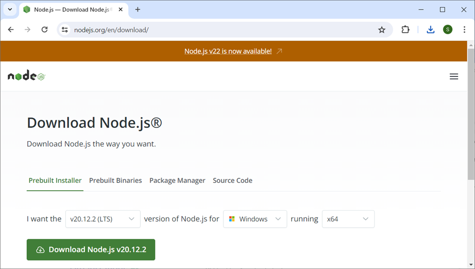

And then follow the instructions of the Installer to complete the installation process.

Note that installing node using the Installer also installs npm.

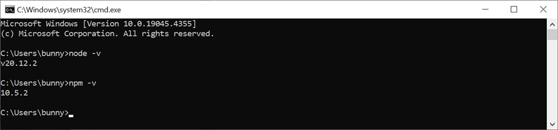

## Step 2: Create an empty application folder

Create an application folder in your local machine/laptop with the name:
__github-3.6-soon-node-http-serverless__.

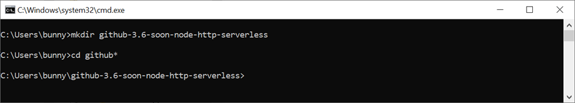

## Step 3: Install the serverless package globally

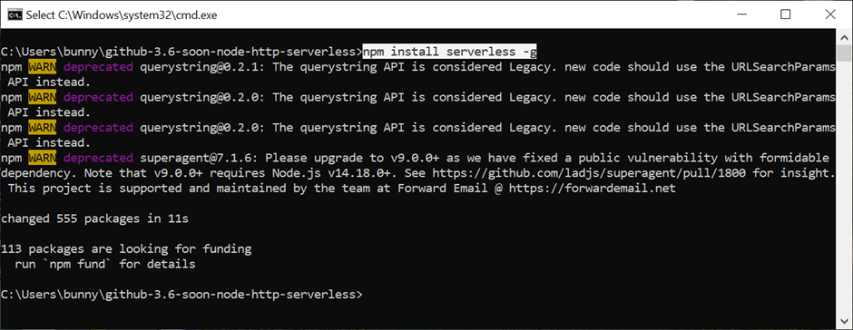

## Step 4: Start the serverless setup process

Use the __serverless__ command to setup your serverless application. You will be prompted with a number of questions to configure your serverless environment:

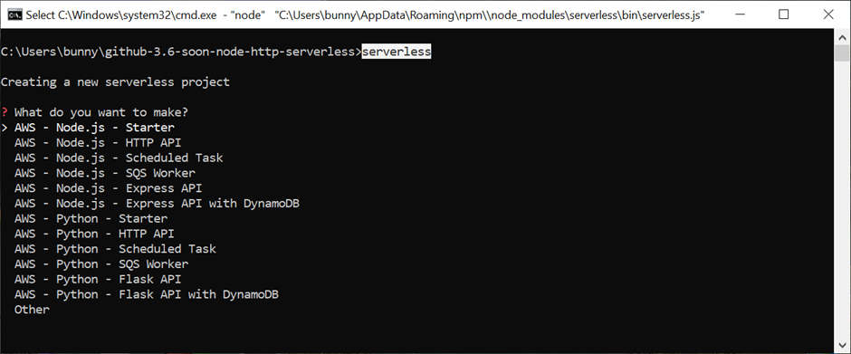

### Step 4.1: Select AWS - Node.js - HTTP API

Use up and down arrow keys to navigate the options above. In this case, we are going to select __AWS - Node.js - HTTP API__. Press the __Enter__ key to confirm the selection.

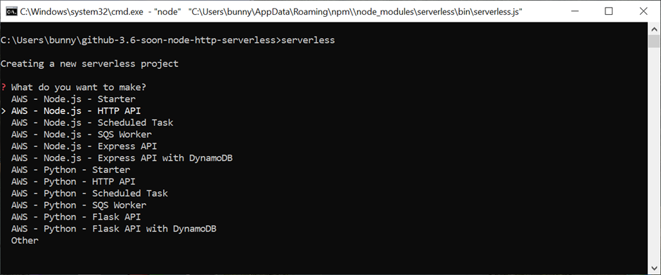

### Step 4.2: Type node-http-serverless-soon as the project name.

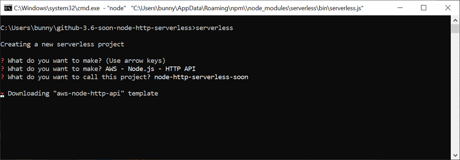

Upon completion of the download, the Serverless Framework will create some template files to a new project folder __node-http-serverless-soon__ in the current folder.

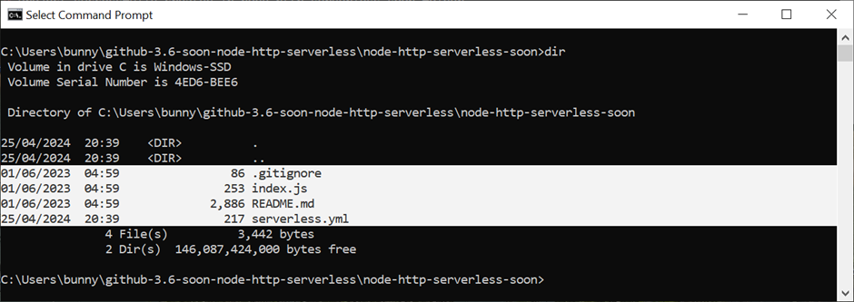

The details of the files in the
__C:\Users\bunny\github-3.6-soon-node-http-serverless\node-http-serverless-soon__ folder are shown below:

__.gitignore__
```
# package directories
node_modules
jspm_packages

# Serverless directories
.serverless
```

__index.js__
``` Node.js
module.exports.handler = async (event) => {
  return {
    statusCode: 200,
    body: JSON.stringify(
      {
        message: "Go Serverless v3.0! Your function executed successfully!",
        input: event,
      },
      null,
      2
    ),
  };
};
```

__serverless.yml__
``` yaml
service: node-http-serverless-soon
frameworkVersion: '3'

provider:
  name: aws
  runtime: nodejs18.x

functions:
  api:
    handler: index.handler
    events:
      - httpApi:
          path: /
          method: get
```

The contents of README.md is too long and left out for brevity.

### Step 4.3: Press n and then Enter for Register or Login to Serverless Framework.

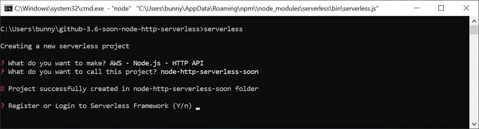

### Step 4.4: Press n and then Enter for Do you want to deploy now?

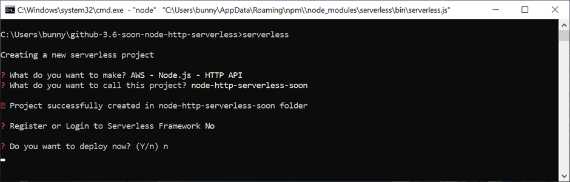

Beware that when you type __n__ and then __Enter__ for the first time, the cursor will go to the second line as shown above. Please type __n__ again and you will see the same prompt appearing again:

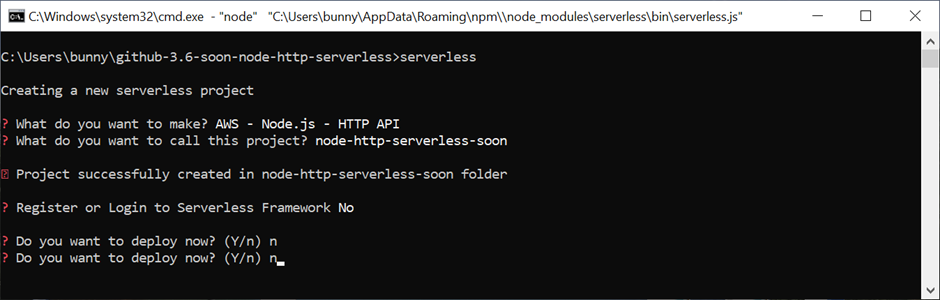

Now, just press the __Enter__ key to confirm the selection.

Here is the screensshot of the complete setup process.

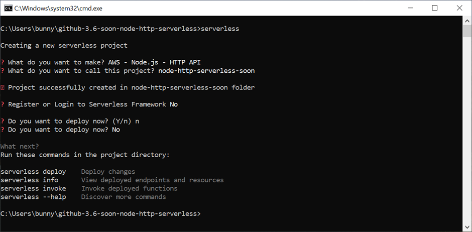

## Step 5: Deploy the serverless application

Before you deploy your application, please ensure that you are in the project folder that you just created.

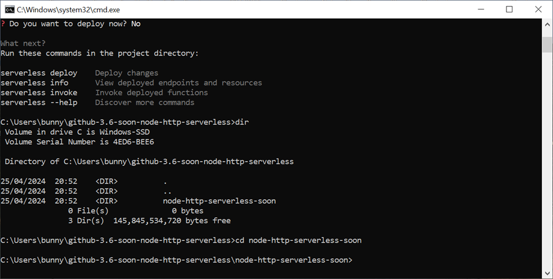

If you deploy the application in the wrong folder, you will get an error:

Error:
```
This command can only be run in a Serverless service directory. Make sure to reference a valid config file in the current working directory if you're using a custom config file
```

To deploy the application, use the __serverless deploy__ command:

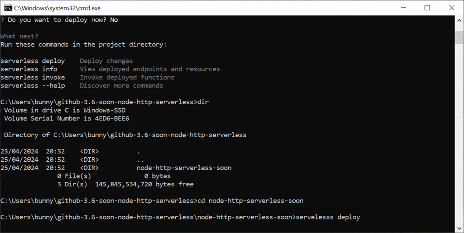

The next few screenshots showed what happened during the application deployment process.

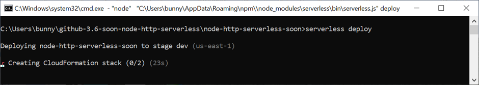

The configuration details in the __serverless.yml__ file are used to create the CloudFormation stack files to be uploaded to the provider AWS.

These stack files are generated in a folder __.serverless__ within the project folder.

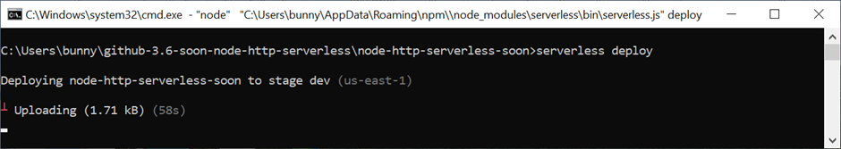

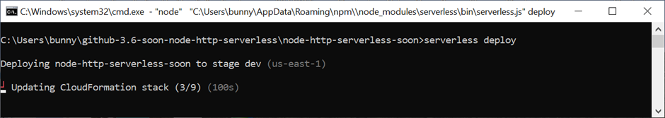

The deployment details within these stack files are uploaded to AWS to create the necessary resources needed to run the application.

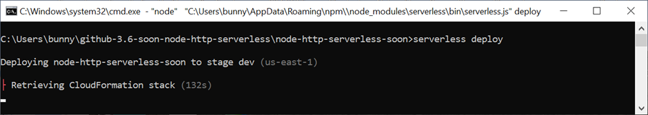

Once all the resources are created in AWS, the details of the endpoints and so on are retrieved for display to the user.

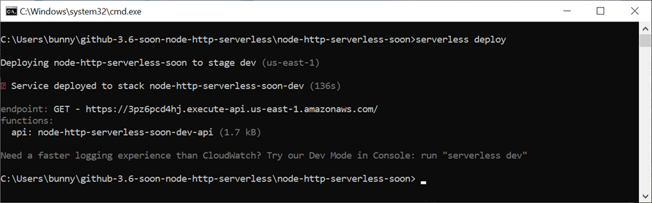

The preceding screenshot shows that the endpoint for the GET API is accessible at __https://3pz6pcd4hj.execute-api.us-east-1.amazonaws.com/__

We can use the __curl__ command to test the endpoint as shown in the next screenshot.

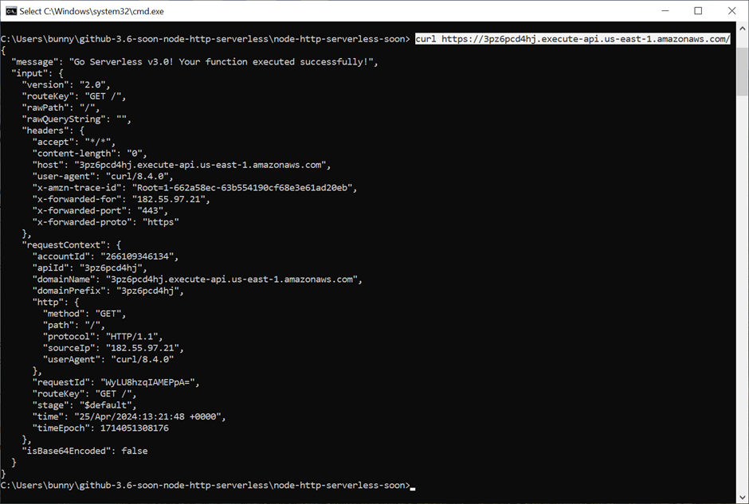

``` yaml
{
  "message": "Go Serverless v3.0! Your function executed successfully!",
  "input": {
    "version": "2.0",
    "routeKey": "GET /",
    "rawPath": "/",
    "rawQueryString": "",
    "headers": {
      "accept": "*/*",
      "content-length": "0",
      "host": "3pz6pcd4hj.execute-api.us-east-1.amazonaws.com",
      "user-agent": "curl/8.4.0",
      "x-amzn-trace-id": "Root=1-662a58ec-63b554190cf68e3e61ad20eb",
      "x-forwarded-for": "182.55.97.21",
      "x-forwarded-port": "443",
      "x-forwarded-proto": "https"
    },
    "requestContext": {
      "accountId": "266109346134",
      "apiId": "3pz6pcd4hj",
      "domainName": "3pz6pcd4hj.execute-api.us-east-1.amazonaws.com",
      "domainPrefix": "3pz6pcd4hj",
      "http": {
        "method": "GET",
        "path": "/",
        "protocol": "HTTP/1.1",
        "sourceIp": "182.55.97.21",
        "userAgent": "curl/8.4.0"
      },
      "requestId": "WyLU8hzqIAMEPpA=",
      "routeKey": "GET /",
      "stage": "$default",
      "time": "25/Apr/2024:13:21:48 +0000",
      "timeEpoch": 1714051308176
    },
    "isBase64Encoded": false
  }
}
```

Alternatively, we can test the endpoint using the browser:

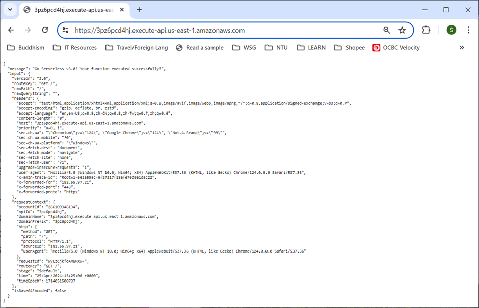

# D. Verifications of resources created in AWS

The next few screenshots showed the resources created in AWS:
- CloudFormation stack
- S3 bucket
- Lambda function
- API Gateway
- CloudWatch logs

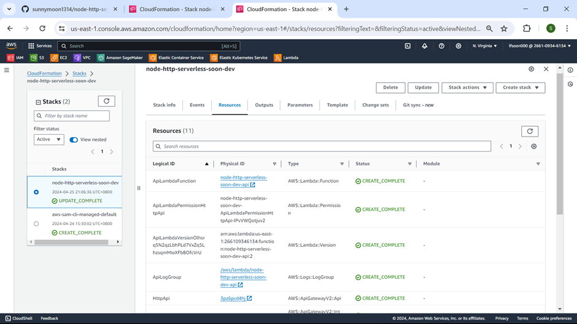

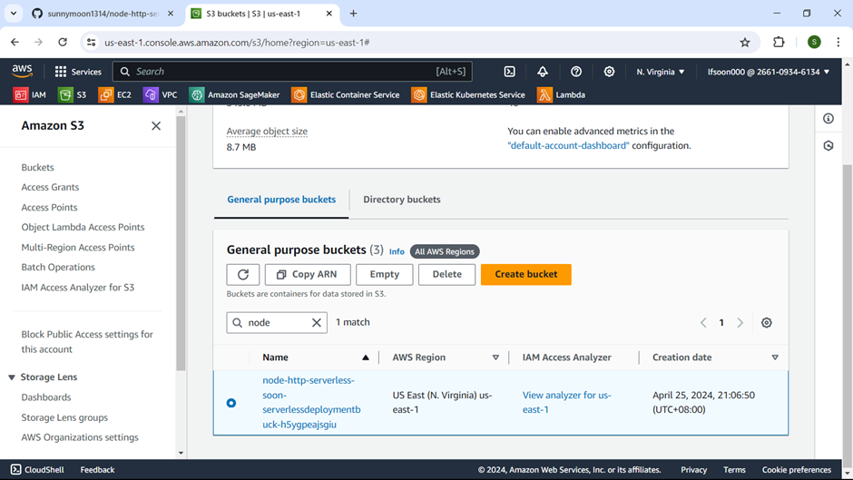

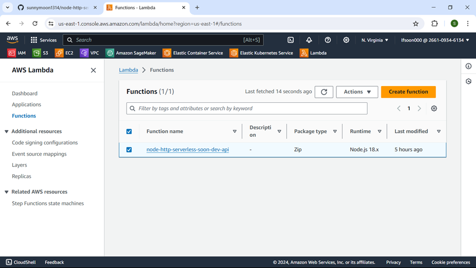

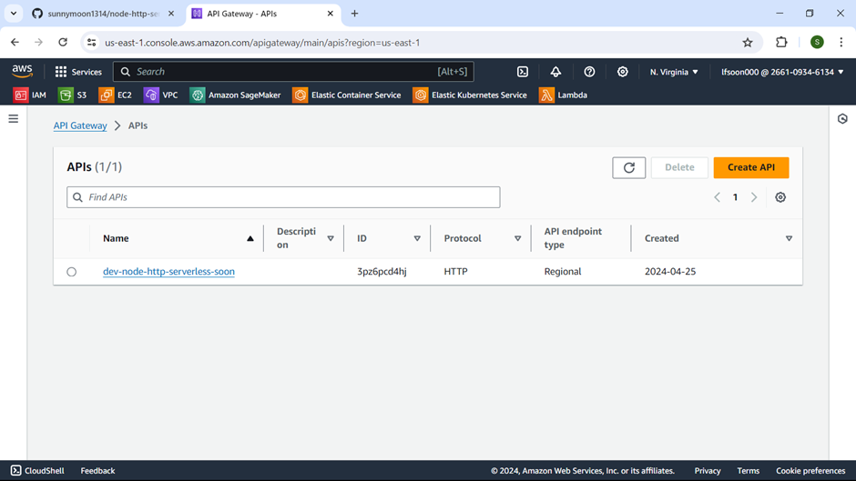

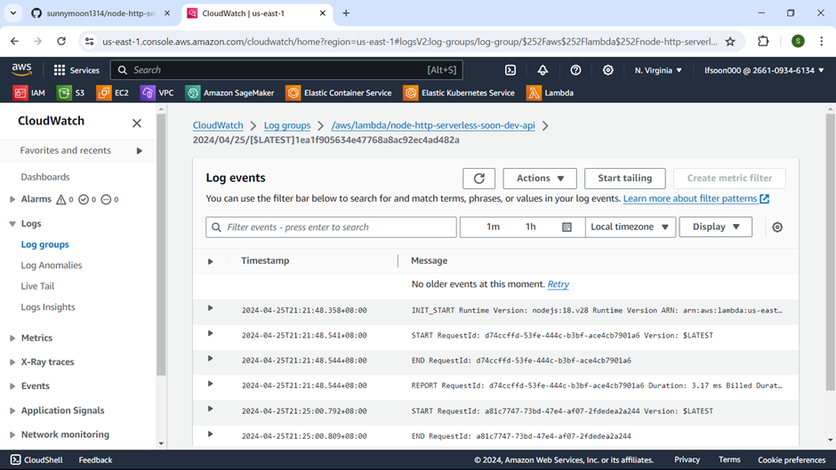

# E. Destroy the resources created in AWS

Once we have verified our application is working as expected, we should delete all the resources that are deployed to AWS using the __serverless remove__ command.


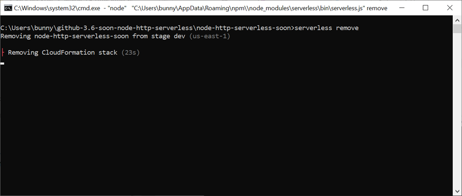

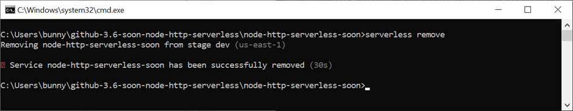

# Suggestion for future works

So far we have seen how the serverless application is implemented with only a GET REST API endpoint.

We will look at how the application features can be enhanced to make the endpoint respond to:
- Other REST API actions such as POST, PUT, etc.
- Events that are triggerd by other AWS services such as S3 bucket when data is loaded into it, etc.
